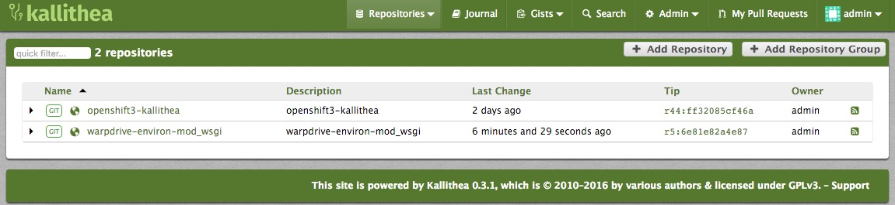
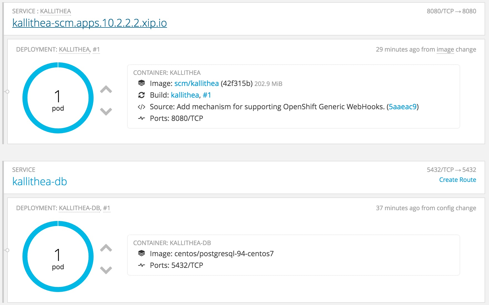
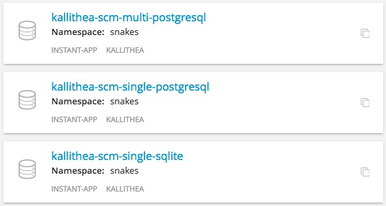

# Kallithea for OpenShift 3

[Kallithea SCM](https://kallithea-scm.org) is an Open Source, source code management system that supports the two leading version control systems, Mercurial and Git, and has a web interface that is easy to use for users and admins.

This project repository contains all the files you need to deploy a Kallithea instance to OpenShift 3. This includes deployment of a database and the initialisation of that database for the Kallithea application.

An extension module is also installed for Kallithea which implements a web hook mechanism that can be linked up to OpenShift in order to automatically trigger a new build and deployment of your application within OpenShift whenever you push up changes to a Git repository managed by Kallithea.





The reasons for developing this project are as follows:

1. To provide an easy way of deploying Kallithea to an OpenShift cluster, enabling you to manage the source code repositories, rather than needing to use a source code hosting service such as GitHub, BitBucket or GitLab. 
2. As a case study for how the building and deployment of a Python web application can be managed using [warpdrive](http://www.getwarped.org).
3. As a case study for how a complex web application, requiring persistent storage, a database, and other services, can be deployed to OpenShift.

Although the primary target for deploying Kallithea is OpenShift, it is possible to also deploy to Docker. No pre built image is provided for this scenario, but if interested, instructions can be provided for how you can create the required Docker image from this project repository using the [Source to Image](https://github.com/openshift/source-to-image) (S2I) tool.

## Deployment Options

Three different ways of deploying Kallithea are currently provided.



These are:

**kallithea-scm-single-sqlite** - This option deploys a single instance of Kallithea, using a file based SQLite database stored within the persistent volume used to store the Git/Mercurial repositories. Initialisation of the database and subsequent database migrations are handled through action hooks executed within the Kallithea instance when it is being started. This option does not support scaling up to multiple instances.

**kallithea-scm-single-postgresql** - This option deploys a single instance of Kallithea along with an instance of the PostgreSQL database, as separate containers in the same pod. The PostgreSQL database and the Git/Mercurial repositories are stored on a shared persistent volume. Initialisation of the database and subsequent database migrations are handled through action hooks executed within the Kallithea instance when it is being started. This option does not support scaling up to multiple instances.

**kallithea-scm-multi-postgresql** - This option deploys a single instance of Kallithea along with an instance of the PostgreSQL database, as separate containers running in distinct pods. The PostgreSQL database and the Git/Mercurial repositories are stored on a shared persistent volume. OpenShift life cycle hooks are used to automatically initialise the database on the first deployment, as well as manage database migrations on subsequent deployments when required. The Kallithea web application can be scaled up provided that the OpenShift cluster being used supports ``ReadWriteMany`` persistent volumes. This volume type is needed to allow multiple instances to be run on different nodes, with the persistent volume mounted on all instances.

## Quick Installation

To install, you can run the following steps using the OpenShift ``oc`` command line tool. After having run the step to load the templates, rather than use ``oc``, you could also add the application from the OpenShift web console.

**Create a new project within your OpenShift cluster.**

```
$ oc new-project scm
Now using project "scm" on server "https://10.2.2.2:8443".

You can add applications to this project with the 'new-app' command. For example, try:

    $ oc new-app centos/ruby-22-centos7~https://github.com/openshift/ruby-hello-world.git

to build a new hello-world application in Ruby.
```

**Load the application template for Kallithea.**

```
$ oc create -f https://raw.githubusercontent.com/GrahamDumpleton/openshift3-kallithea/master/template.json
template "kallithea-scm-multi-postgresql" created
template "kallithea-scm-single-postgresql" created
template "kallithea-scm-single-sqlite" created
```

**Create the Kallithea application.**

```
$ oc new-app kallithea-scm
--> Deploying template kallithea-scm-single-postgresql for "kallithea-scm-single-postgresql"
     With parameters:
      Application instance name=kallithea
      Application admin user=admin # generated
      Application admin user password=kqTdYGwaQRUqukcB # generated
      Application admin email=admin@example.com # generated
      Application memory limit=384Mi
      Application volume capacity=512Mi
      PostgreSQL database user=userE3T # generated
      PostgreSQL user password=1AHjOO7Pn4svCRJJ # generated
      PostgreSQL memory limit=384Mi
--> Creating resources with label app=kallithea ...
    imagestream "kallithea" created
    buildconfig "kallithea" created
    deploymentconfig "kallithea" created
    persistentvolumeclaim "kallithea-pvc" created
    service "kallithea" created
    route "kallithea" created
--> Success
    Build scheduled, use 'oc logs -f bc/kallithea' to track its progress.
    Run 'oc status' to view your app.
```

**Determine the exposed hostname for Kallithea.**

```
$ oc describe route kallithea
Name:			kallithea
Created:		60 seconds ago
Labels:			app=kallithea,template=kallithea-scm-single-postgresql-template,web=kallithea
Annotations:		openshift.io/generated-by=OpenShiftNewApp
			openshift.io/host.generated=true
Requested Host:		kallithea-scm.apps.10.2.2.2.xip.io
			  exposed on router router 60 seconds ago
Path:			<none>
TLS Termination:	edge
Insecure Policy:	Allow
Service:		kallithea
Endpoint Port:		8080-tcp
Endpoints:		<none>
```

**Monitor the build and deployment process.**

```
$ oc status
In project scm on server https://10.2.2.2:8443

https://kallithea-scm.apps.10.2.2.2.xip.io (and http) to pod port 8080-tcp (svc/kallithea)
  dc/kallithea deploys
    istag/kallithea:latest <- bc/kallithea builds https://github.com/GrahamDumpleton/openshift3-kallithea.git#master with openshift/python:2.7
    deployment #1 running for 60 seconds - 1 pod
    openshift/postgresql:9.4
    deployment #1 running for 60 seconds - 1 pod

View details with 'oc describe <resource>/<name>' or list everything with 'oc get all'.
```

**Access the Kallithea instance (when the build and deployment has completed).**

```
open https://kallithea-scm.apps.10.2.2.2.xip.io
```

**Login using the 'admin' user account (use the generated password output by 'oc new-app').**

```
      Application admin user=admin # generated
      Application admin user password=kqTdYGwaQRUqukcB # generated
```


 


